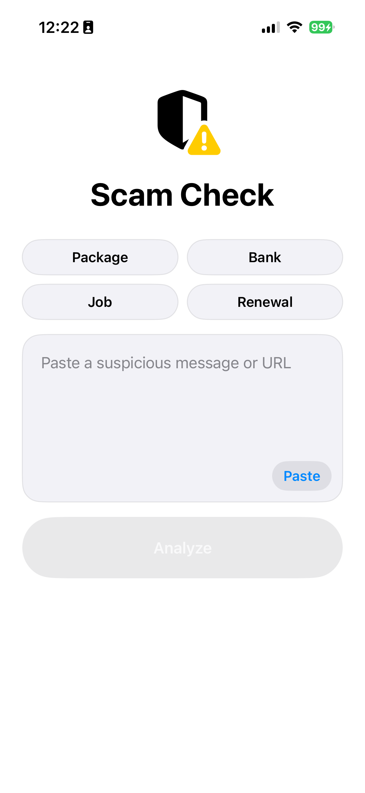
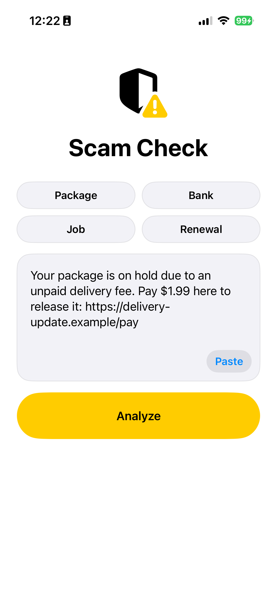
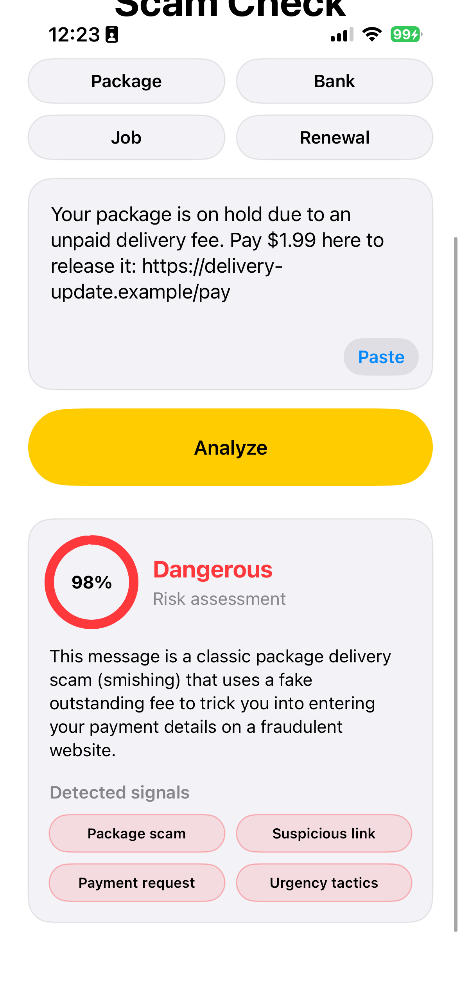

# AI-First Mobile Engineering Internship Assignment (Gen Digital)

SwiftUI Scam Message Detector screen prototype for the Gen Digital AI-First Mobile Engineering assignment.

## Demo Link

[YouTube Link](https://youtu.be/vu1vsRskV3k)

## Project Overview

I chose **Option B: Scam Message Detector**.

The app is an iOS SwiftUI prototype inspired by Norton Genie-style scam detection. A user can paste or type a suspicious SMS, email snippet, or URL, tap **Analyze**, and receive a risk assessment performed by AI with:

- risk level: Safe, Suspicious or Dangerous
- confidence score
- short explanation of the matched warning signs
- detected scam signals
- tappable example scam messages that auto-fill the input

## Features

- SwiftUI single-screen scam detector - adaptive interface with Dark Mode support, keyboard management using `@FocusState`
- Gemini API Integration - fully integrated `gemini-3.5-flash` using native `URLSession`
- example scam chips for quick demo input
- confidence ring and result card
- MVVM-style state management with `ScamAnalyzing` abstracts the network layer, allowing UI to remain separate from Gemini API, in case a local heuristic is implemented further along
- unit tests for Gemini Scam Analyzer logic, Networking and Scam Detector ViewModel

## Project Structure

```text
.
├── README.md
├── screenshots
│   ├── main_screen.png
│   ├── scam_message.png
│   └── result.png
├── ScamDetector
│   ├── ScamDetector
│   │   ├── AI
│   │   │   ├── GeminiAPIModels.swift
│   │   │   ├── GeminiPromptBuilder.swift
│   │   │   ├── GeminiResponseParser.swift
│   │   │   ├── GeminiScamAnalyzer.swift
│   │   │   └── ScamAnalyzing.swift
│   │   ├── Assets.xcassets
│   │   ├── Models
│   │   │   ├── ScamAnalysisResult.swift
│   │   │   ├── ScamAnalysisState.swift
│   │   │   ├── ScamExampleMessage.swift
│   │   │   └── ScamRiskLevel.swift
│   │   ├── ViewModels
│   │   │   └── ScamDetectorViewModel.swift
│   │   ├── Networking
│   │   │   ├── APIConfiguration.swift
│   │   │   ├── HTTPClient.swift
│   │   │   └── URLSessionHTTPClient.swift
│   │   ├── UI
│   │   │   └── ScamDetectorView.swift
│   │   ├── ContentView.swift
│   │   └── ScamDetectorApp.swift
│   ├── ScamDetector.xcodeproj
│   ├── ScamDetectorTests
│   │   ├── GeminiScamAnalyzerTests.swift
│   │   ├── NetworkingTests.swift
└── └── └── ScamDetectorViewModelTests.swift

```

## Setup Instructions

Requirements:

- macOS with Xcode installed
- iOS Simulator or physical iOS device

Steps:

1. Clone the repository.
2. Open `ScamDetector.xcodeproj` in Xcode.
3. Select the App scheme in the top bar ("ScamDetector" with the yellow app icon).
4. Click **Edit Scheme... -> Run -> Arguments.**
5. Under **Environment Variables**, add:

* Name: `GEMINI_API_KEY`

* Value: `[Your Google AI Studio Key]`
6. Press **Run**.

To run tests in Xcode:

Press **Cmd + U** to run the unit test suites. *Note: Tests use mocked network protocols and do not require a valid API key.*

## Testing

The project includes the following unit tests:

- `GeminiScamAnalyzerTests`: Tests configuration edge cases (missing or whitespace API keys), API request building, HTTP 500 status error handling, and integrated parsing edge cases (malformed JSON and confidence score clamping).
- `NetworkingTests`: uses Apple's native `URLProtocol` to intercept network calls without making live requests, testing hardware network failures (`URLError`) and non-HTTP response safety.
- `ScamDetectorViewModelTests`: uses a `MockScamAnalyzer` to test UI state transitions, input validation (empty or whitespace messages), example message loading, and proper state updates for both successful and failed analysis attempts.

All of the test suites were AI-generated and then reviewed.

## Screenshots

``Screenshots of the application in Light Mode.``






## AI Interaction Log
I used AI as a Staff iOS Engineer for architecture planning, edge-case discovery, and rigorous code reviews. Output was not accepted blindly. I actively reviewed the generated output and pushed back when output was not ideal.

I used AI as part of the normal development workflow for review, test generation and architecture planning. AI output code was review and refined where needed.

Following section demonstrates the key prompts used during the development of the assignment.


**Prompt**:

```text
I have to do this assignment for AI-First Mobile Engineering Internship from Gen Digital. Here is the assignment instructions for context. I want to make the option B - scam message detector. I want to use Swift (SwiftUI). I need you to act as a Staff iOS Engineer and break this project down into a step-by-step architectural plan. DO NOT WRITE ANY CODE yet. I want to use AI instead of heuristic, I have an API key for gemini from google ai studio. List the exact Swift files I will need for the UI, AI analyzer and viewmodels
```

**AI response summary**:
The AI processed the constraints and generated a comprehensive MVVM + Service architecture plan, detailing the exact file structure without writing implementation code.

**My evaluation**:
The step-by-step plan was a strong starting point and it separated the risk areas. Further actions were taken step by step, which was reviewed before continuing.


**Prompt**:

```text
lets build view model without gemini. create ScamDetectorViewModel.swift. analyze() method can just sleep for 2 seconds to mimick ai api work. Ensure the viewmodel is separate from UI, so I can change analyze() later when ai api will be used
```

**AI response summary**:
Generated the ViewModel handling state, input, and an async analyze() stub that simulated latency.

**My evaluation**:
The generated output was almost okay. I needed to change the older ObservableObject protocol for a newer @Observable macro. Besides that the output was accepted.


**Prompt**:

```text
Okay, now i need UI. I want a simple UI with an icon "shield.lefthalf.filled.trianglebadge.exclamationmark" underneath it "Scam Check" text. In the middle of the screen is a text input field with round corners (user RoundedRectangle) with a button in the right lower corner "Paste", underneath it "Analyze" button 
```

**AI response**:
Built the initial SwiftUI view according to the visual specifications.
**My evaluation**:
I spotted UX flaws like keyboard remaining stuck open after typing, which was then iteratively fixed. Besides that the UI lacked auto populating quick-action scam message examples, which were also iteratively added. Besides that I fixed manually UI color theme, which was a minor fix. 


**Prompt**:

```text
okay, it looks good. Now i need to add gemini integration, where a prompt carrying message input and requesting just the confidence, explanation and detected signals from json.
```

**AI response summary**:

Generated the networking stack, including GeminiScamAnalyzer, JSON schema mapping, and standard REST implementations.

**My evaluation**:
The implementation was good with a minor flaw, that LLM output was not checked safely and therefore the payload could break the logic. I fixed this by mapping to the Swift domain models.
**Prompt**:

```text
write a GeminiScamAnalyzerTests.swift test suite covering especially edge cases like configuration (missing api key,...), not working network (server error) and LLM output edge case testing
```

**AI response summary**:
Wrote comprehensive edge-case tests following the input areas.

**My evaluation**:
Following the feedback after I requested a code review, the tests helped uncover issues, which I could then address in code and fix. 

## AI Code Review summary
As part of the final development phase, I prompted the AI to act as a Staff iOS Engineer and perform a strict code review of the entire architecture, networking, and UI. The AI identified several critical and minor issues, which I either addressed or acknowledged as a tradeoff.

## Reflection
This assignment was an incredible exercise in orchestrating AI rather than just typing code. The most valuable lesson I learned was that AI is fantastic at writing "happy path" code, but a human engineer is still required to anticipate edge cases, race conditions, and production constraints.

If I had more time, I would explore adding SwiftData to save previous scan histories and Share Extension could be useful, so users could send texts directly from the Messages app to the Scam Detector.
